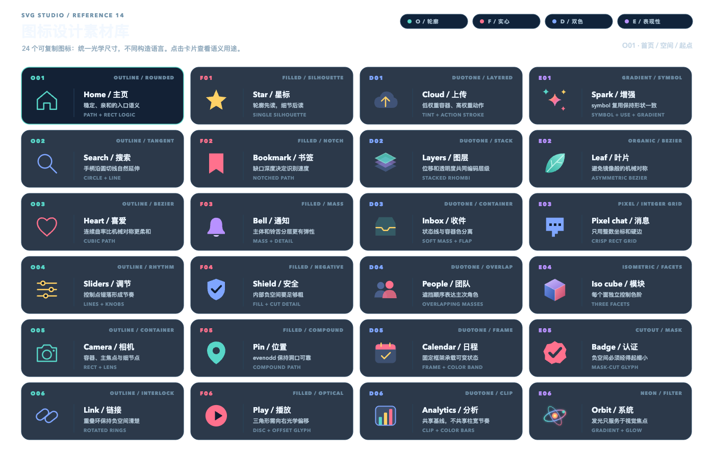
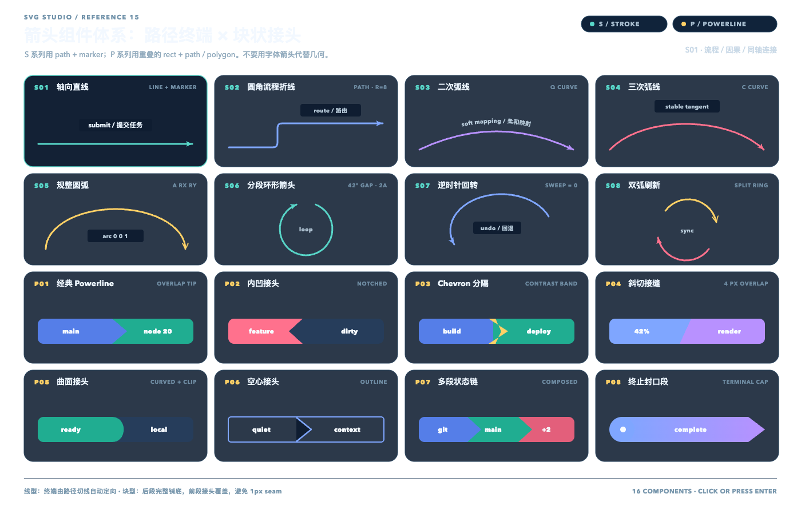

# SVG Studio

Fifteen transparent-canvas studies that treat vector geometry as a programmable medium. Paper.js constructs precise geometry; Rough.js supplies selective hand-drawn texture, while the arrow, icon, and component reference libraries are authored as native, editable SVG.

`catalog.json` records the design use, motivating question, family, complexity, and tags for every scene.

| Botanical | Metro | Orbits | Topology |
|---|---|---|---|
|  |  |  |  |
| Isometric city | Wave lab | Contour map | Circuit |
|  |  |  |  |
| Timeline | Molecule | Loom | Type system |
|  |  |  |  |
| Arrow library | Icon library | Arrow components |  |
|  |  |  |  |

## Arrow reference library

Open `/?scene=arrow-library` to browse 18 connected line + arrow + label templates. The library includes straight, curved, orthogonal, loopback, bridge, dashed, dotted, wavy, dimension, composition, and gradient connectors; labels can sit above/below, interrupt the line, cross it, follow it with `textPath`, repeat along it, or attach as a callout.

- Editable source: [`examples/arrow-library.svg`](examples/arrow-library.svg)
- Agent drawing guide: [`docs/arrow-library.md`](docs/arrow-library.md)
- Machine-readable template index: [`arrow-library.json`](arrow-library.json)
- Browser API: `window.__ARROW_LIBRARY__.select('B02')` and `getTemplate('B02')`

## Icon reference library

Open `/?scene=icon-library` to browse 24 native SVG icons across outline, filled, duotone, gradient, organic, pixel, isometric, negative-space, and neon styles.

- Editable source: [`examples/icon-library.svg`](examples/icon-library.svg)
- Machine-readable template index: [`icon-library.json`](icon-library.json)
- Browser API: `window.__ICON_LIBRARY__.select('E04')` and `getTemplate('E04')`

## Arrow component systems

Open `/?scene=arrow-components` to compare two reusable construction systems. The eight `S` templates use `line` or `path` plus `marker-end` for straight, rounded-orthogonal, Bézier, elliptical, angle-gapped loop, return, and refresh arrows. The eight `P` templates use overlapping `rect`, `path`, and `polygon` geometry for Powerline-style tips, notches, chevrons, slants, curved joints, outlines, chains, and terminal caps; one shared `clipPath` rounds only each strip's outer boundary.

- Editable source: [`examples/arrow-components.svg`](examples/arrow-components.svg)
- Machine-readable template index: [`arrow-components.json`](arrow-components.json)
- Browser API: `window.__ARROW_COMPONENTS__.select('P07')` and `getTemplate('S06')`

```bash
npm install
npm test
```

`npm test` type-checks, builds, opens every scene in real headless Chrome with the network blocked, exercises pointer interaction, exports the stage with `omitBackground`, and validates real alpha plus visible/colorful pixel thresholds. It checks each native SVG library against its JSON index, including references, style coverage, accessibility titles, and keyboard/click selection; the arrow scenes additionally check marker, `textPath`, stroke-system, and solid-segment coverage, while the icon scene checks gradients, masks, clipping, symbols, and primitive variety.
