# SVG Studio

Twelve transparent-canvas studies that treat vector geometry as a programmable medium. Paper.js constructs precise geometry; Rough.js supplies selective hand-drawn texture.

`catalog.json` records the design use, motivating question, family, complexity, and tags for every scene.

| Botanical | Metro | Orbits | Topology |
|---|---|---|---|
| 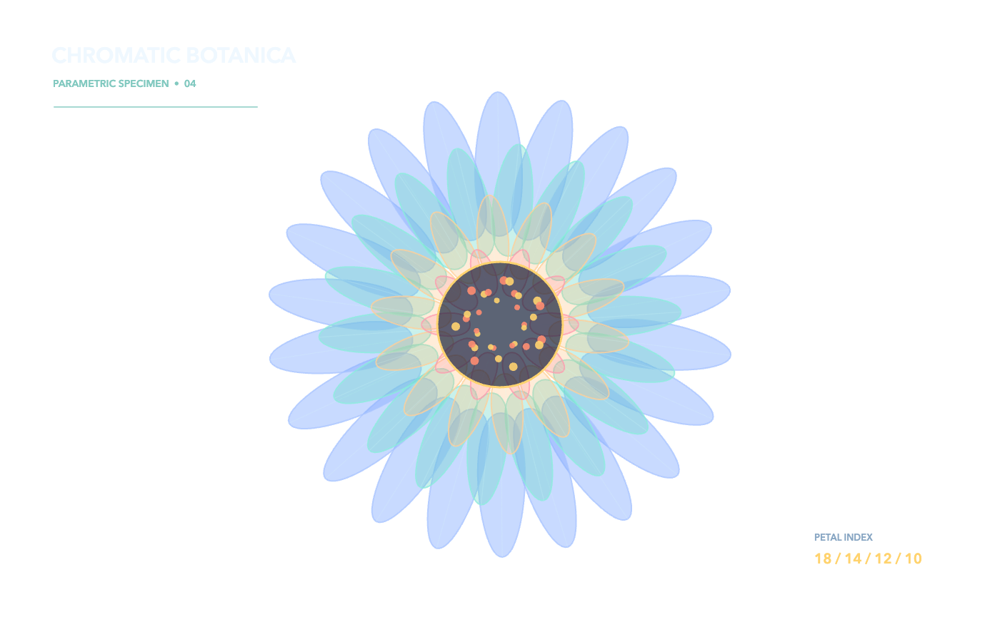 | 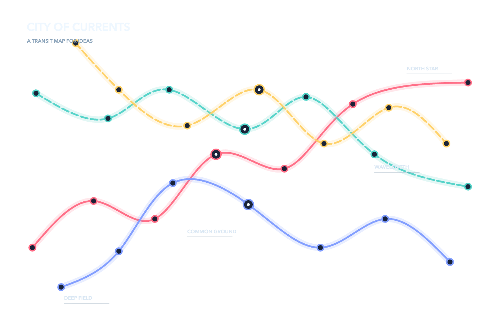 | 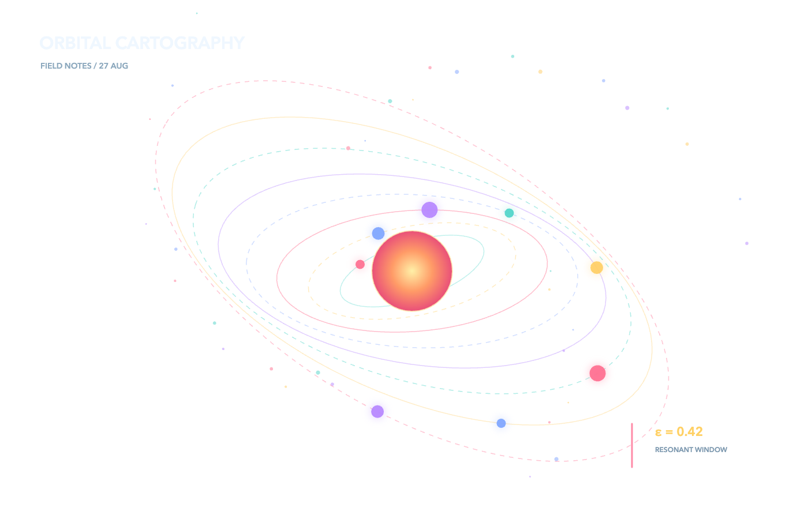 | 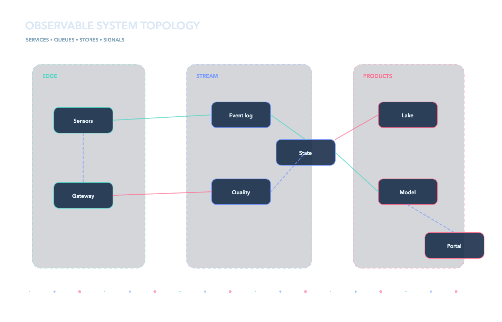 |
| Isometric city | Wave lab | Contour map | Circuit |
| 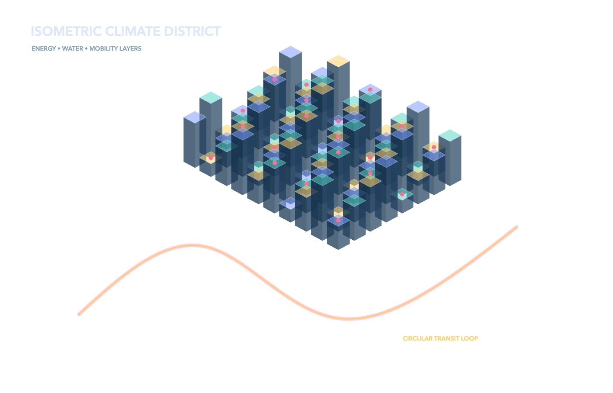 | 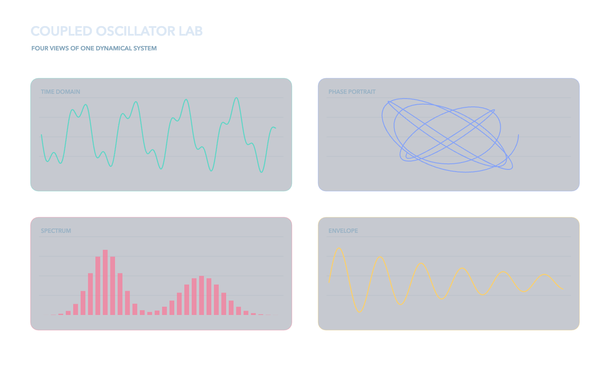 | 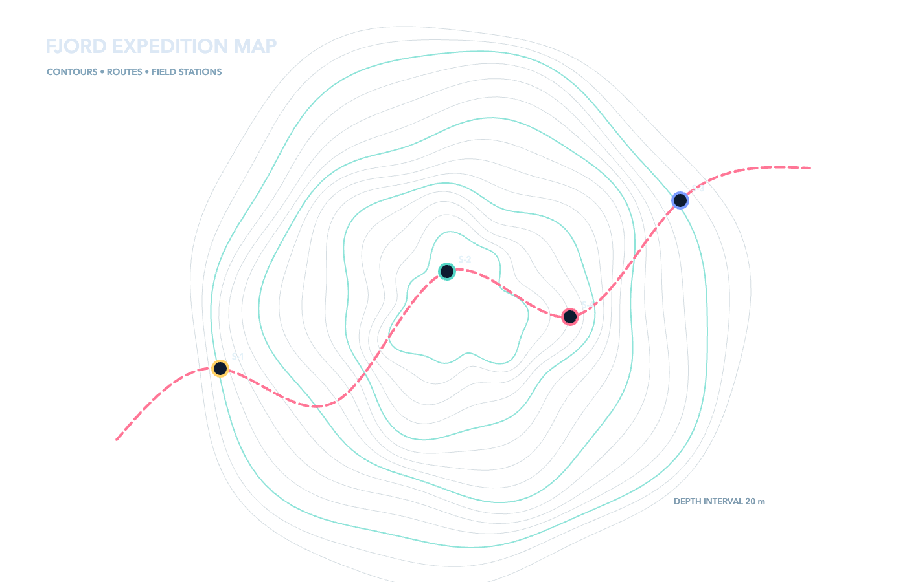 | 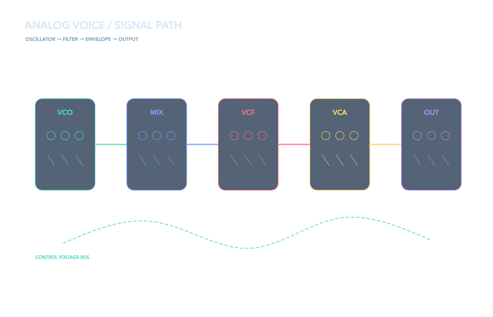 |
| Timeline | Molecule | Loom | Type system |
| 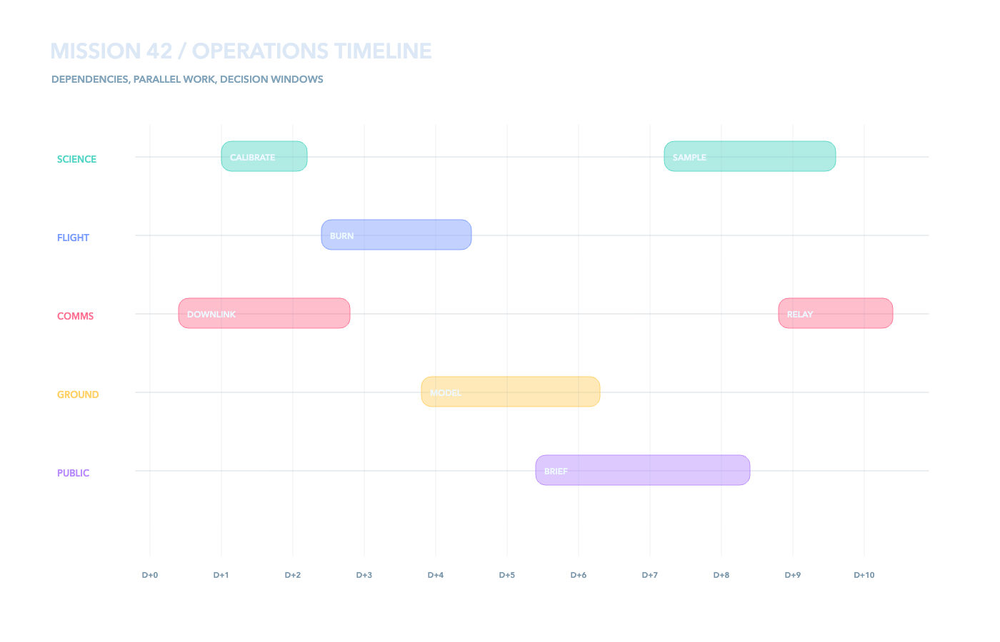 | 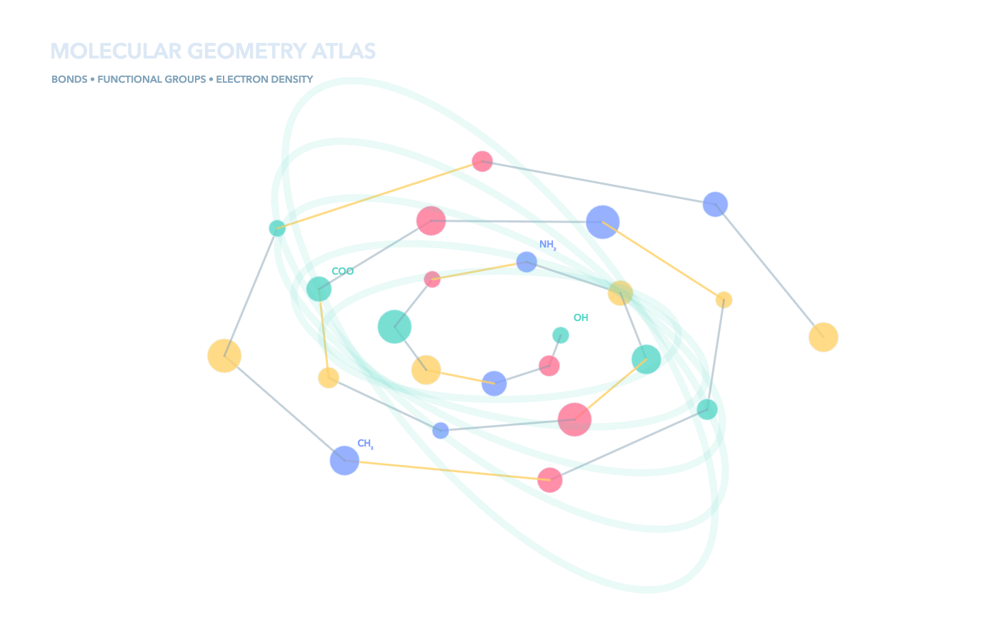 | 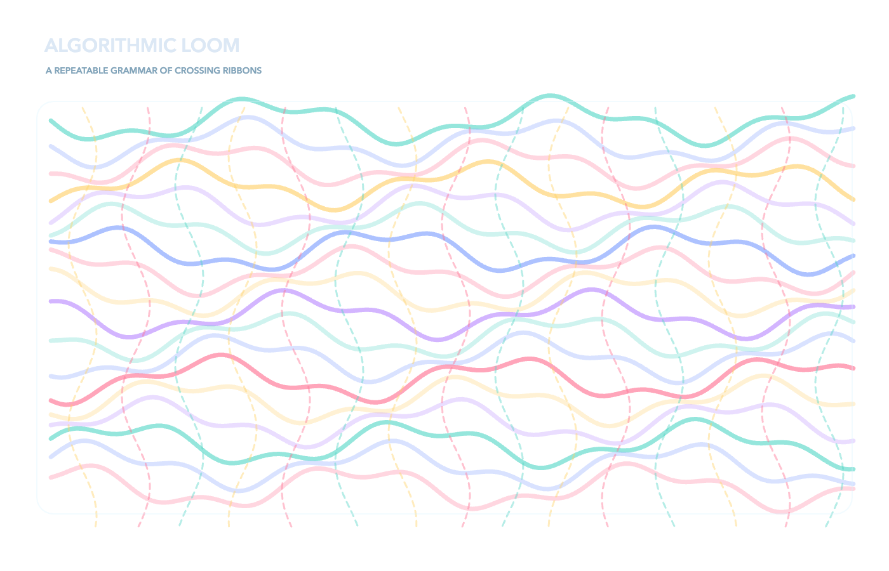 | 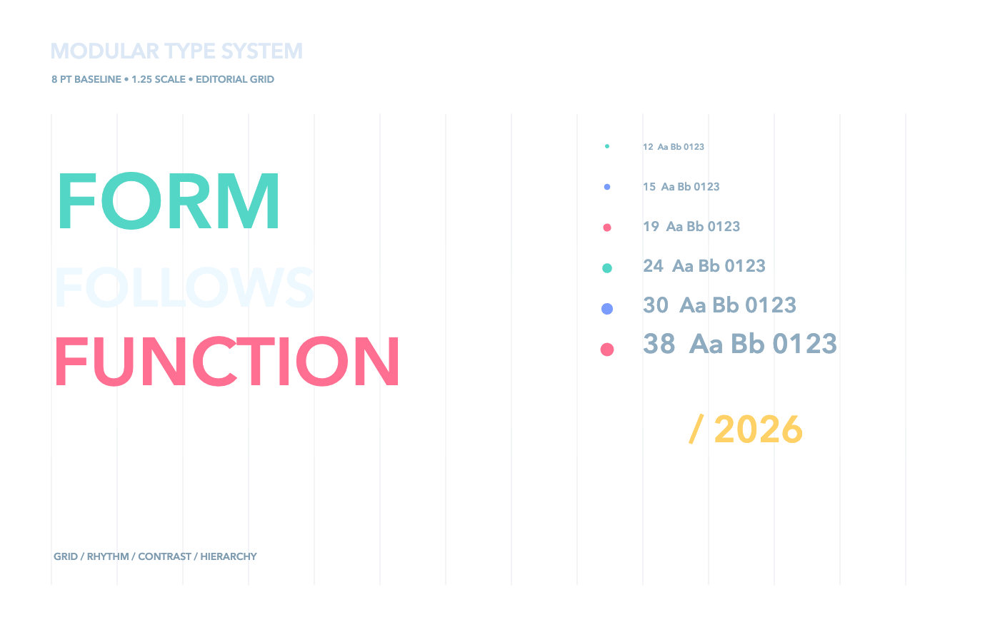 |

```bash
npm install
npm test
```

`npm test` type-checks, builds, opens every scene in real headless Chrome with the network blocked, exercises pointer interaction, exports the stage with `omitBackground`, and validates real alpha plus visible/colorful pixel thresholds.
