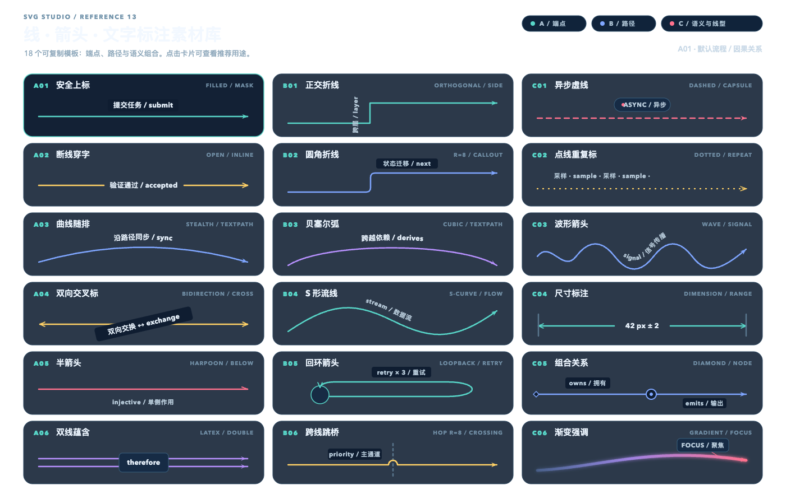

# SVG Studio

Thirteen transparent-canvas studies that treat vector geometry as a programmable medium. Paper.js constructs precise geometry; Rough.js supplies selective hand-drawn texture, while the arrow reference library is authored as native, editable SVG.

`catalog.json` records the design use, motivating question, family, complexity, and tags for every scene.

| Botanical | Metro | Orbits | Topology |
|---|---|---|---|
|  |  |  |  |
| Isometric city | Wave lab | Contour map | Circuit |
|  |  |  |  |
| Timeline | Molecule | Loom | Type system |
|  |  |  |  |
| Arrow library |  |  |  |
|  |  |  |  |

## Arrow reference library

Open `/?scene=arrow-library` to browse 18 connected line + arrow + label templates. The library includes straight, curved, orthogonal, loopback, bridge, dashed, dotted, wavy, dimension, composition, and gradient connectors; labels can sit above/below, interrupt the line, cross it, follow it with `textPath`, repeat along it, or attach as a callout.

- Editable source: [`examples/arrow-library.svg`](examples/arrow-library.svg)
- Agent drawing guide: [`docs/arrow-library.md`](docs/arrow-library.md)
- Machine-readable template index: [`arrow-library.json`](arrow-library.json)
- Browser API: `window.__ARROW_LIBRARY__.select('B02')` and `getTemplate('B02')`

```bash
npm install
npm test
```

`npm test` type-checks, builds, opens every scene in real headless Chrome with the network blocked, exercises pointer interaction, exports the stage with `omitBackground`, and validates real alpha plus visible/colorful pixel thresholds. For the arrow library it also checks all 18 stable IDs against the JSON index, native SVG structure, marker references, label modes, `textPath` coverage, accessibility titles, and keyboard/click selection.
