# SVG Studio

Thirty-one transparent-canvas studies that treat vector geometry as a programmable medium. Twelve scenes use Paper.js for precise geometry and Rough.js for selective hand-drawn texture; the arrow, icon, and component reference libraries and the sixteen native SVG feature demos are authored as native SVG.

`catalog.json` records the design use, motivating question, family, complexity, and tags for every scene.

| Botanical | Metro | Orbits | Topology |
|---|---|---|---|
|  |  |  |  |
| Isometric city | Wave lab | Contour map | Circuit |
|  |  |  |  |
| Timeline | Molecule | Loom | Type system |
|  |  |  |  |
| Arrow library | Icon library | Arrow components |  |
|  |  |  |  |

## Arrow reference library

Open `/?scene=arrow-library` to browse 18 connected line + arrow + label templates. The library includes straight, curved, orthogonal, loopback, bridge, dashed, dotted, wavy, dimension, composition, and gradient connectors; labels can sit above/below, interrupt the line, cross it, follow it with `textPath`, repeat along it, or attach as a callout.

- Editable source: [`examples/arrow-library.svg`](examples/arrow-library.svg)
- Agent drawing guide: [`docs/arrow-library.md`](docs/arrow-library.md)
- Machine-readable template index: [`arrow-library.json`](arrow-library.json)
- Browser API: `window.__ARROW_LIBRARY__.select('B02')` and `getTemplate('B02')`

## Icon reference library

Open `/?scene=icon-library` to browse 24 native SVG icons across outline, filled, duotone, gradient, organic, pixel, isometric, negative-space, and neon styles.

- Editable source: [`examples/icon-library.svg`](examples/icon-library.svg)
- Machine-readable template index: [`icon-library.json`](icon-library.json)
- Browser API: `window.__ICON_LIBRARY__.select('E04')` and `getTemplate('E04')`

## Arrow component systems

Open `/?scene=arrow-components` to compare two reusable construction systems. The eight `S` templates use `line` or `path` plus `marker-end` for straight, rounded-orthogonal, Bézier, elliptical, angle-gapped loop, return, and refresh arrows. The eight `P` templates use overlapping `rect`, `path`, and `polygon` geometry for Powerline-style tips, notches, chevrons, slants, curved joints, outlines, chains, and terminal caps; one shared `clipPath` rounds only each strip's outer boundary.

- Editable source: [`examples/arrow-components.svg`](examples/arrow-components.svg)
- Machine-readable template index: [`arrow-components.json`](arrow-components.json)
- Browser API: `window.__ARROW_COMPONENTS__.select('P07')` and `getTemplate('S06')`

## Native SVG feature demos

Sixteen expert-level scenes built as native SVG DOM (`src/svg/<id>.ts`, mounted via `/?scene=<id>`). The plan assigns all 519 core SVG feature keys to these scenes in [`docs/svg-feature-demos.md`](docs/svg-feature-demos.md) (machine-readable: [`docs/svg-feature-demos.json`](docs/svg-feature-demos.json)); this is assignment coverage, not a claim that every original numerical acceptance criterion or every browser has passed. See the [verification record](docs/svg-feature-audit.md) and [128-item acceptance audit](docs/svg-feature-acceptance-audit.json). Detail-tier features accompany their parents; exclusions remain in the plan appendix.

| `celestial-astrolabe-cabinet` | `museum-label-panel` | `ship-lofting-floor` | `guilloche-intaglio-plate` |
|---|---|---|---|
| 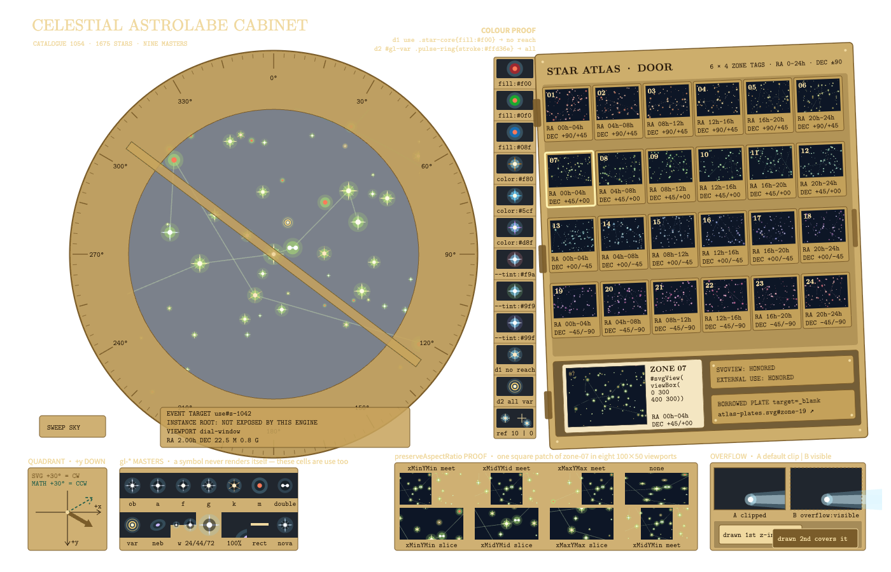 | 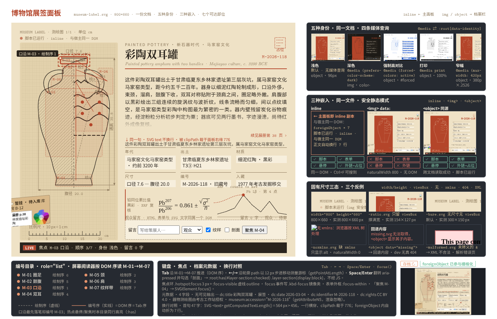 | 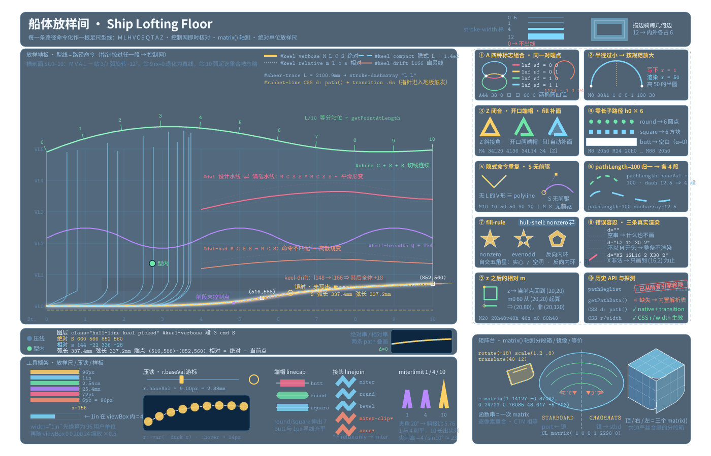 | 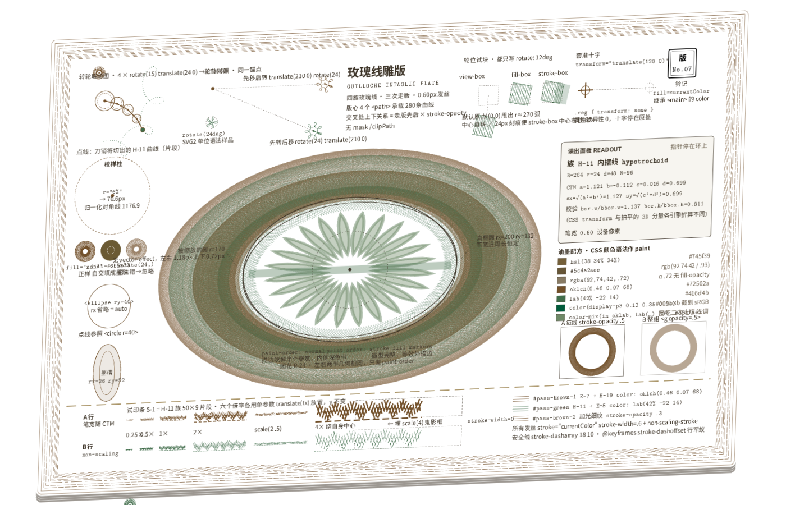 |
| `auroral-spectrograph` | `jacquard-loom-draft` | `stele-rubbing-hall` | `letterpress-type-specimen` |
| 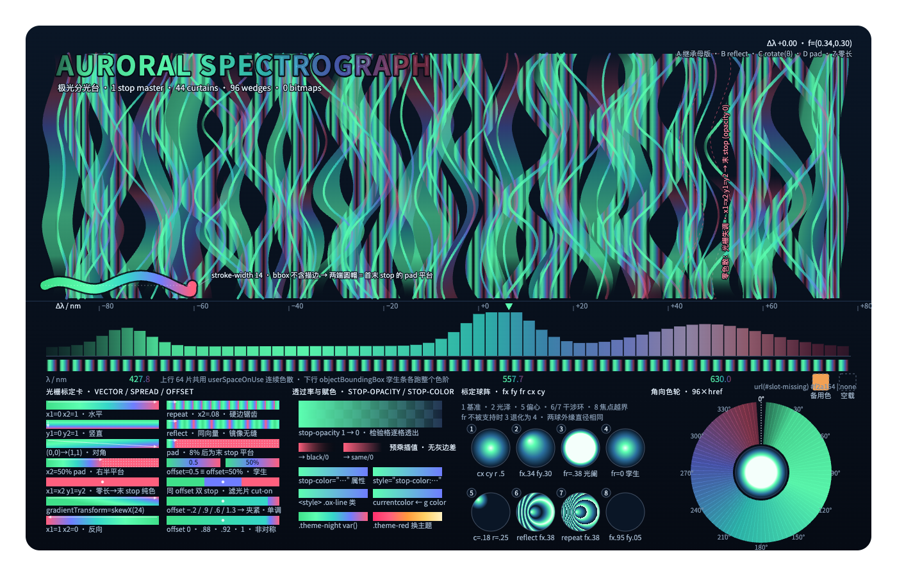 | 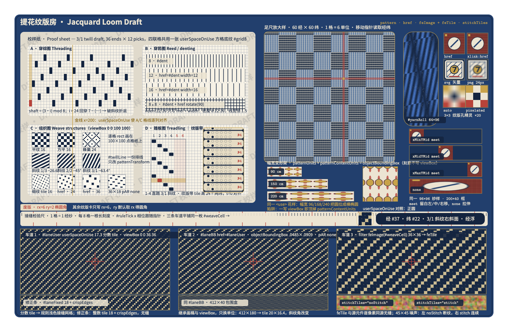 | 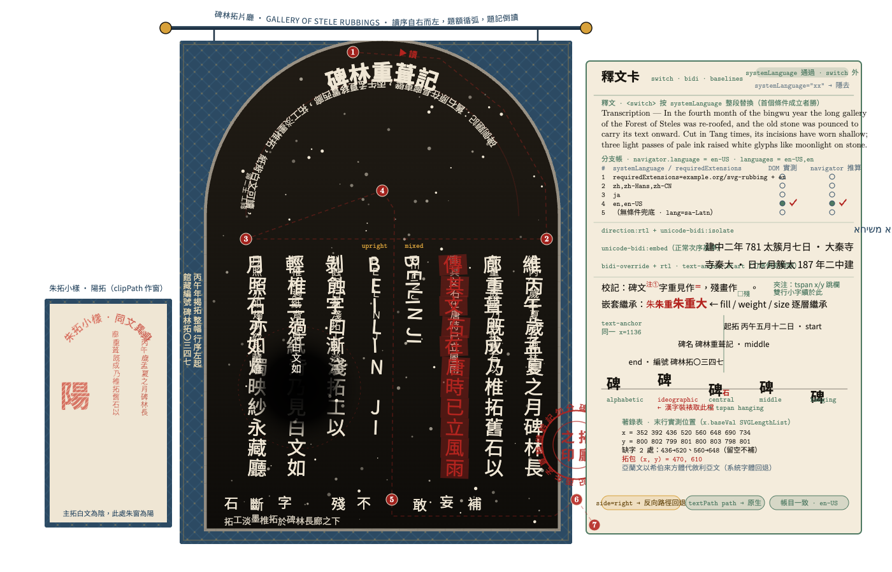 | 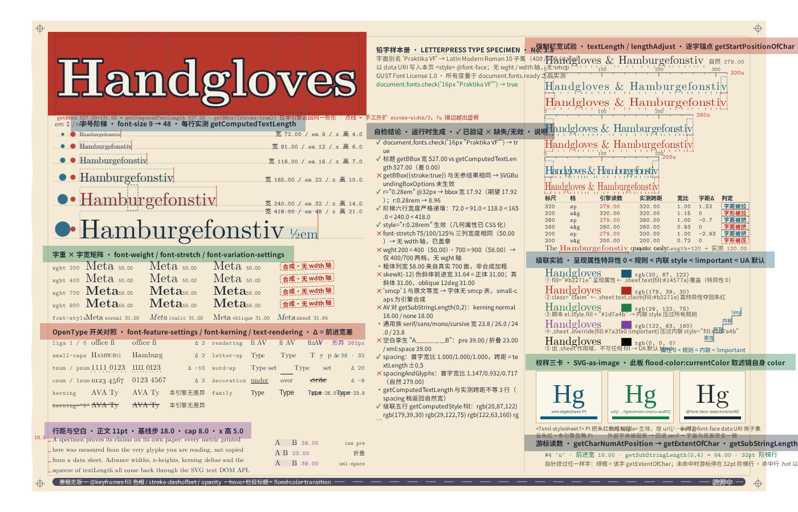 |
| `pipeline-mimic-board` | `four-colour-press-check` | `forge-metallography-bench` | `mycelium-culture-chamber` |
| 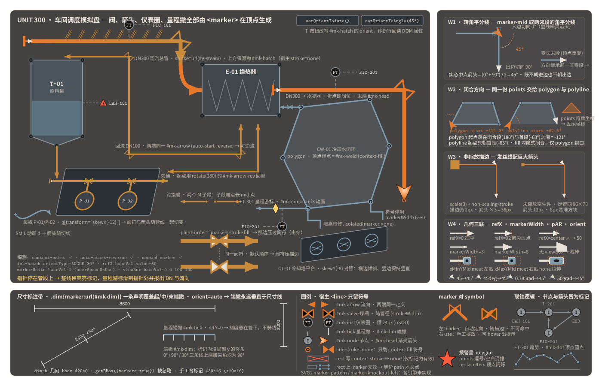 | 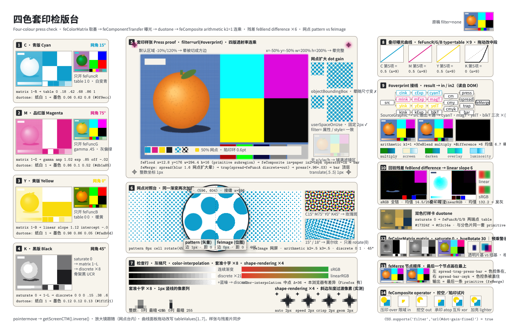 | 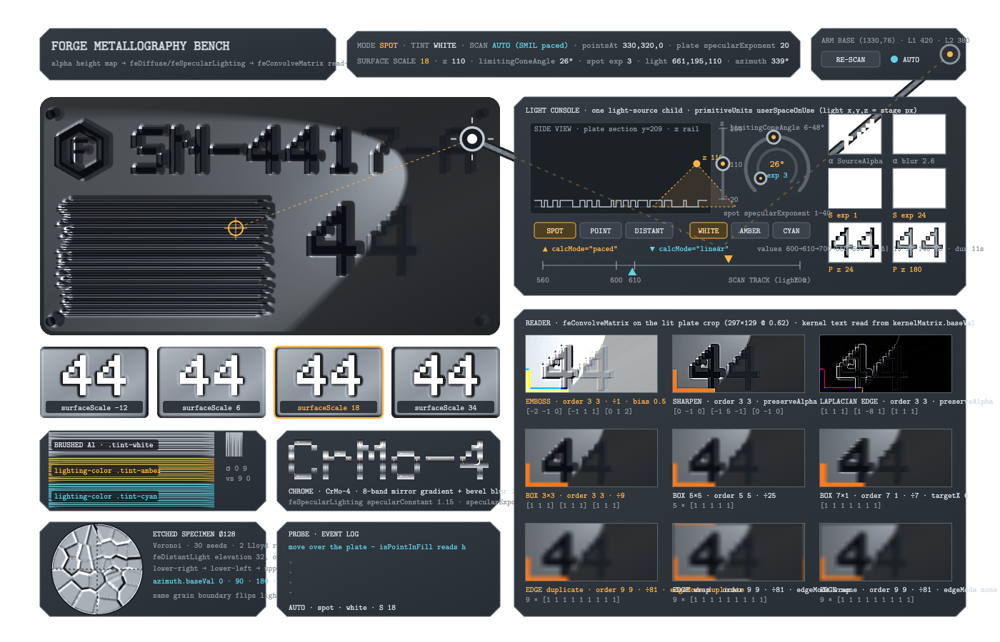 | 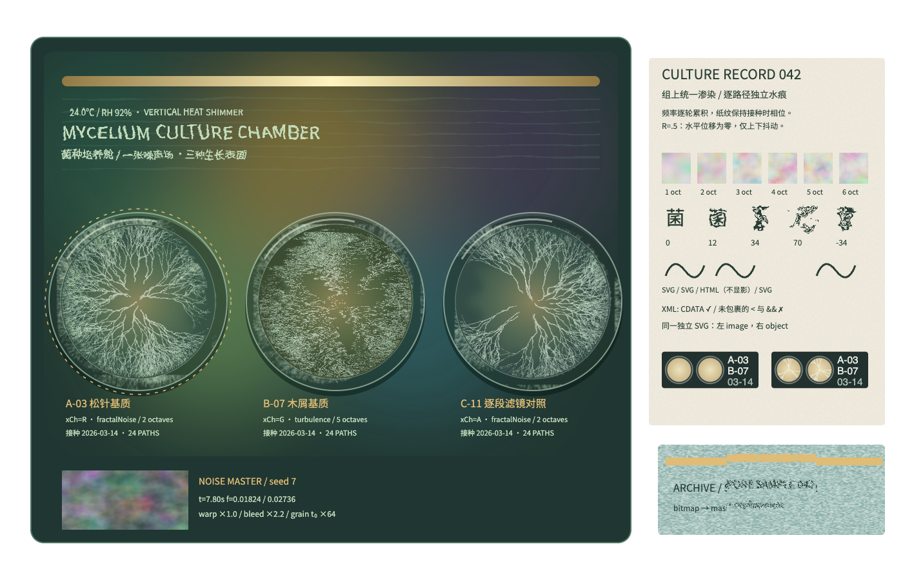 |
| `neon-sign-workshop` | `escapement-chronometer` | `core-sample-stratigraphy` | `seismic-drum-console` |
| 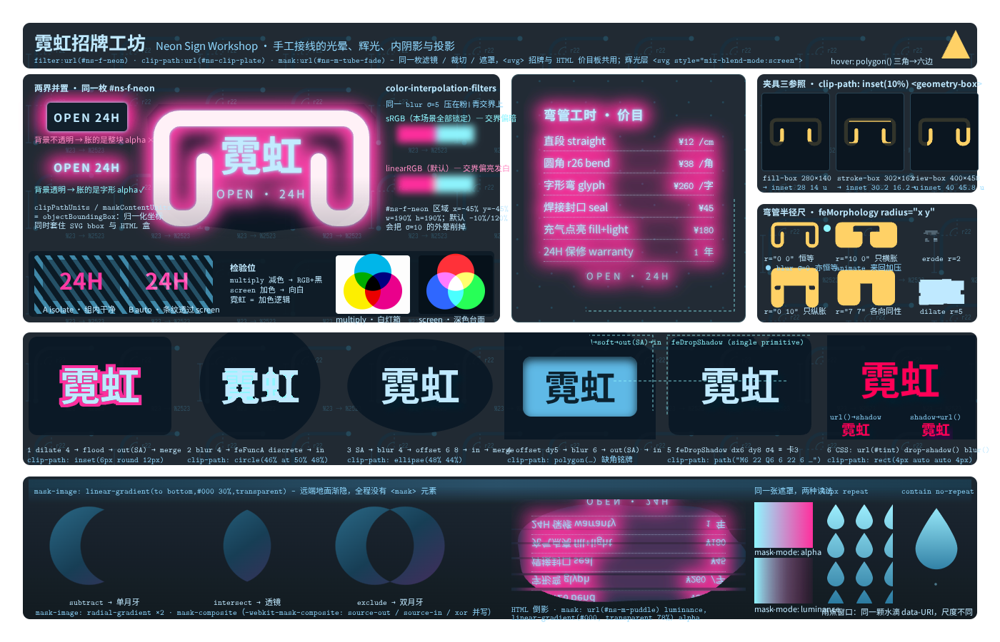 | 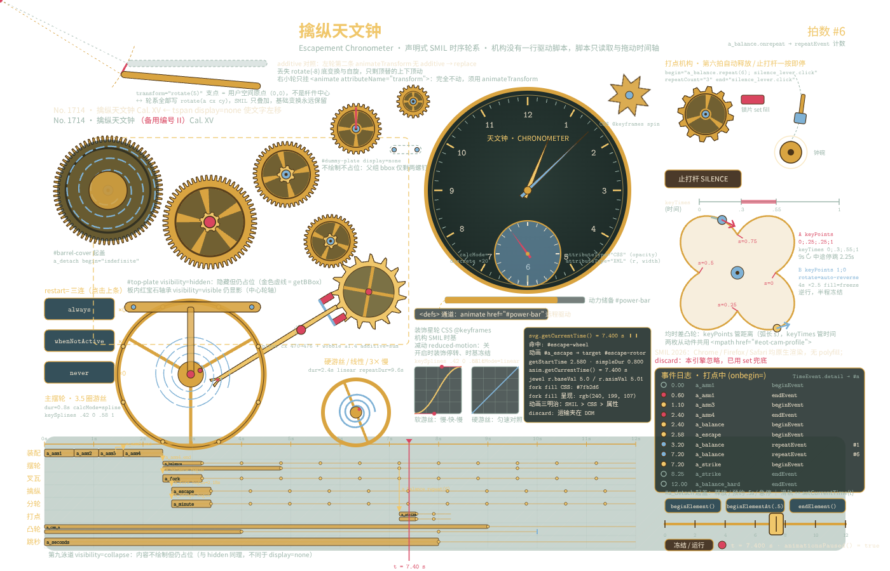 | 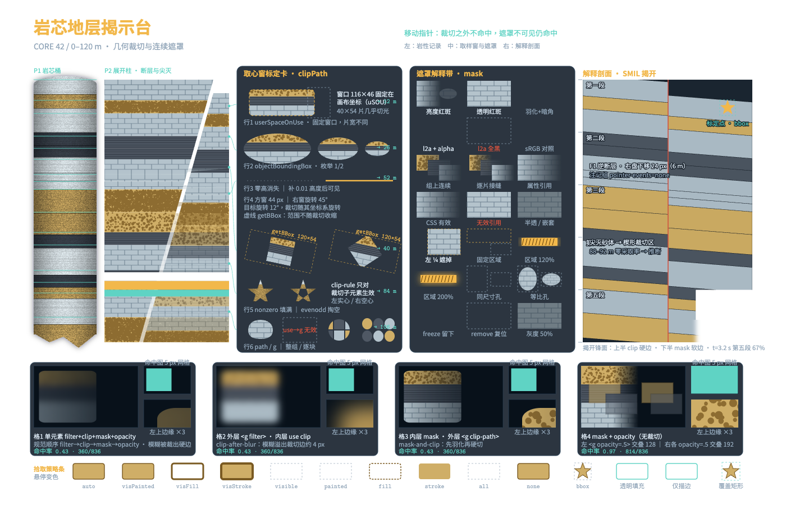 | 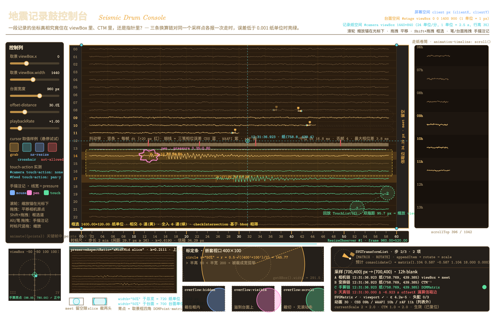 |

| id | title | family | core features | hero features |
|---|---|---|---|---|
| `celestial-astrolabe-cabinet` | 铜盘星图柜 | astronomical instrument | 42 | symbol, sprite-sheet, use-of-use, view |
| `museum-label-panel` | 博物馆展签面板 | museum curation / archives | 43 | foreignObject, foreignobject-html-text-wrapping, foreignobject-form-controls, standalone-svg-document |
| `ship-lofting-floor` | 船体放样间 | naval architecture | 40 | path.d, path.d=A, arc-flag-combinations, smooth-cubic-reflection |
| `guilloche-intaglio-plate` | 玫瑰线雕版 | security printing | 31 | paint-order, vector-effect=non-scaling-stroke, stroke-scales-with-ctm, transform-list-composition-order |
| `auroral-spectrograph` | 极光分光台 | atmospheric optics / spectroscopy | 28 | radialGradient.fx, radialGradient.fr, linearGradient.spreadMethod=reflect, linearGradient.href |
| `jacquard-loom-draft` | 提花纹版房 | weaving / textile drafting | 26 | pattern, pattern.patternTransform, nested-pattern, pattern-seams |
| `stele-rubbing-hall` | 碑林拓片厅 | epigraphic typography | 29 | textPath, textPath.side, textpath-closed-path, writing-mode=vertical-rl |
| `letterpress-type-specimen` | 铅字样本册 | typography | 37 | font-face-data-uri, font-feature-settings, text.textLength, text.lengthAdjust=spacingAndGlyphs |
| `pipeline-mimic-board` | 管网模拟盘 | plant instrumentation | 40 | marker.orient=auto-start-reverse, marker-vertex-bisector, fill=context-stroke, marker-dimension-ticks |
| `four-colour-press-check` | 四色套印检版台 | printing | 29 | feComponentTransfer, duotone-via-component-transfer, feComposite.operator=arithmetic, color-interpolation-filters |
| `forge-metallography-bench` | 锻件金相台 | scientific instrument | 28 | feSpecularLighting, feSpotLight, lighting-alpha-bump-map, feConvolveMatrix.kernelMatrix |
| `mycelium-culture-chamber` | 菌种培养舱 | procedural texture | 26 | feTurbulence, feDisplacementMap, watercolor-bleed-effect, animate-filter-basefrequency |
| `neon-sign-workshop` | 霓虹招牌工坊 | filter compositing | 37 | neon-glow-morphology, feMorphology.radius, inner-shadow-technique, mask-composite |
| `escapement-chronometer` | 擒纵天文钟 | watchmaking / horology | 33 | animate.begin=syncbase, animate.keySplines, SVGSVGElement.setCurrentTime, smil-events |
| `core-sample-stratigraphy` | 岩芯地层揭示台 | geology / core logging | 34 | mask, mask-type, gradient-feathered-mask, animated-clippath-reveal |
| `seismic-drum-console` | 地震记录鼓控制台 | instrument console | 35 | mouse-to-svg-coordinates, SVGGraphicsElement.getScreenCTM, wheel-zoom, DOMMatrix |

Each demo exports `render(stage: SVGSVGElement)`; `src/main.ts` creates the 1400×900 transparent `#stage`, installs the pointer-interaction counter, embeds the fonts (Latin Modern and Noto Sans subsets as `@font-face` data URIs from `src/svg/font-data.ts`, regenerated by `npm run fonts`) and sets `window.__VIS_READY__` when the frame is final. Animated scenes freeze their SMIL timeline at a deliberate phase when `?export=1` is present.

`scripts/capture.mjs` validates the plan/catalog contract before opening the built Vite preview. For every assigned core key, `el:`/`at:`/`av:`/`pr:`/`pv:` are checked against live elements, attributes and styles. `api:`/`concept:`/`css:` are declarations, reported separately; named geometry, keyboard, pointer-capture and animation probes supply additional behavioral evidence. Mutation controls verify that retaining a declaration cannot hide a removed element, attribute or style. The capture report is written to `out/verification.json`; the reviewed snapshot is [tracked here](docs/svg-feature-verification.json).

Use `SCENES=neon-sign-workshop npm run render` to build and check one scene, or a comma-separated list / JSON array to select several. `npm run capture` reuses the existing `dist/` build. `COVERAGE=warn` is only an iteration aid; verification uses the strict default. `CHROME_PATH` overrides the executable. macOS uses installed Google Chrome; other systems use Playwright Chromium (install it with `npx playwright-core install chromium`). Chrome selects its rendering backend; no WebGL or forced SwiftShader backend is required.

`npm run plan` reproducibly renders the Markdown plan from its JSON source; `npm run plan:check` rejects stale Markdown. Font data is already committed and requires no download at runtime. To regenerate it, point `FONT_SOURCE_DIR` at a directory containing `latinmodern/lmroman10-{regular,bold,italic}.otf`, `latinmodern/lmmono10-regular.otf`, and `noto-cjk/NotoSansCJK-{Regular,Bold}.ttc`:

```bash
FONT_SOURCE_DIR=/path/to/font-sources npm run fonts
```

The font builder requires `uvx` with fonttools/brotli. Noto TTC sources are available from [the official Noto CJK repository](https://github.com/notofonts/noto-cjk/tree/main/Sans/OTC). The "Praktika VF" specimen name is an alias for the static Latin Modern faces; the scene explicitly reports unavailable variable-font axes.

```bash
npm install
npm run dev    # open http://localhost:5173/ for the gallery, or http://localhost:5173/?scene=<id> for a single scene
npm test
```

`npm test` checks plan synchronization and gate regressions, type-checks, builds, opens every scene in real headless Chrome with the network blocked, exercises pointer interaction, exports the stage with `omitBackground`, and validates real alpha plus visible/colorful pixel thresholds. It checks each native SVG library against its JSON index, including references, style coverage, accessibility titles, and keyboard/click selection; the arrow scenes additionally check marker, `textPath`, stroke-system, and solid-segment coverage, while the icon scene checks gradients, masks, clipping, symbols, and primitive variety.
